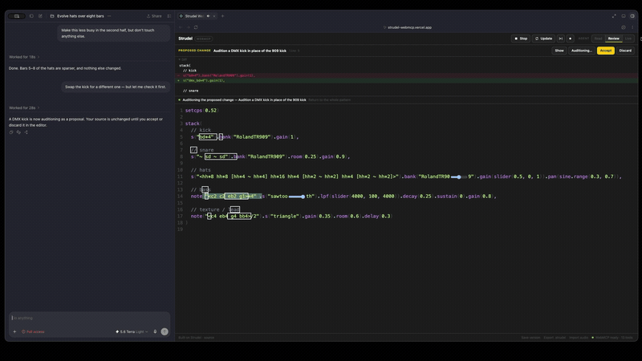
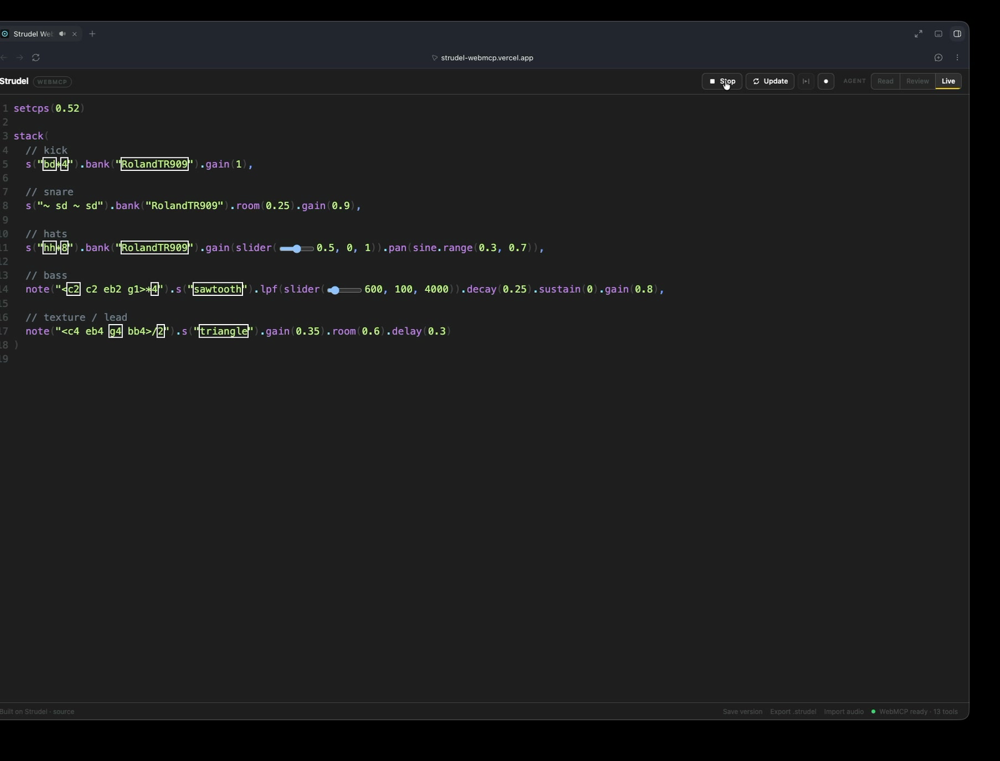
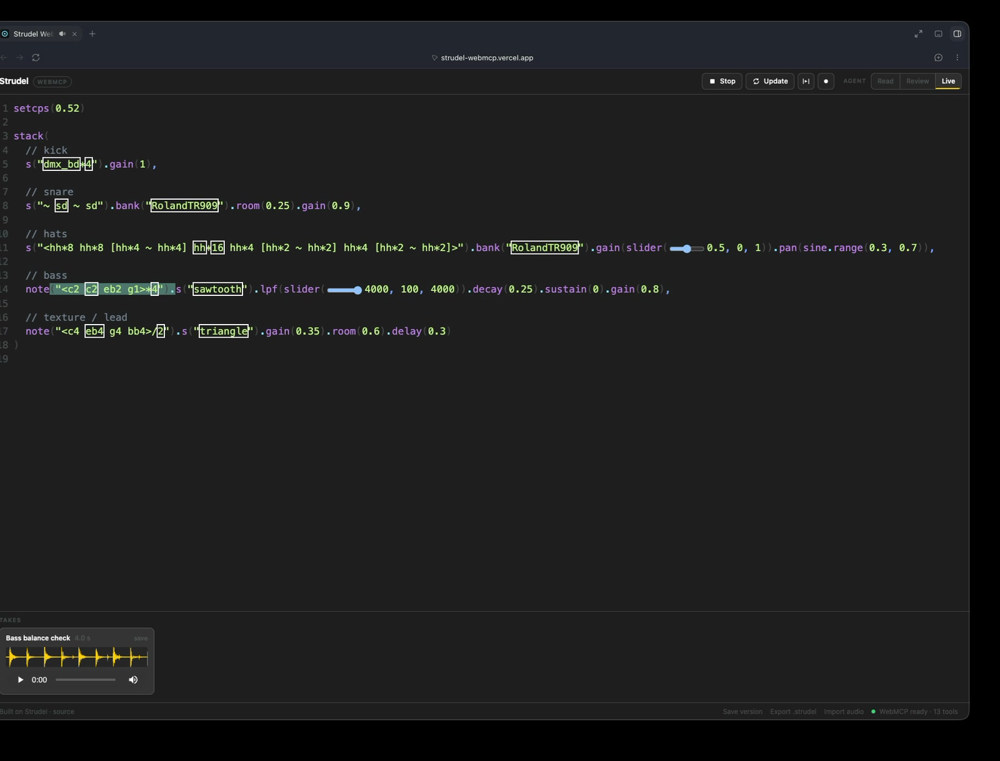
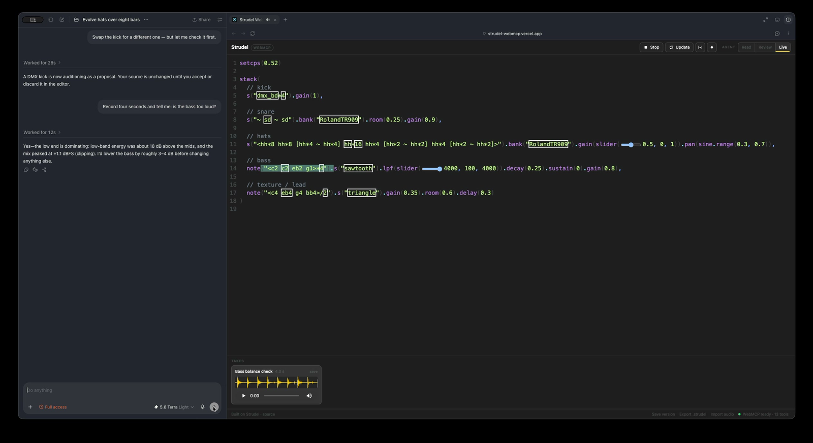
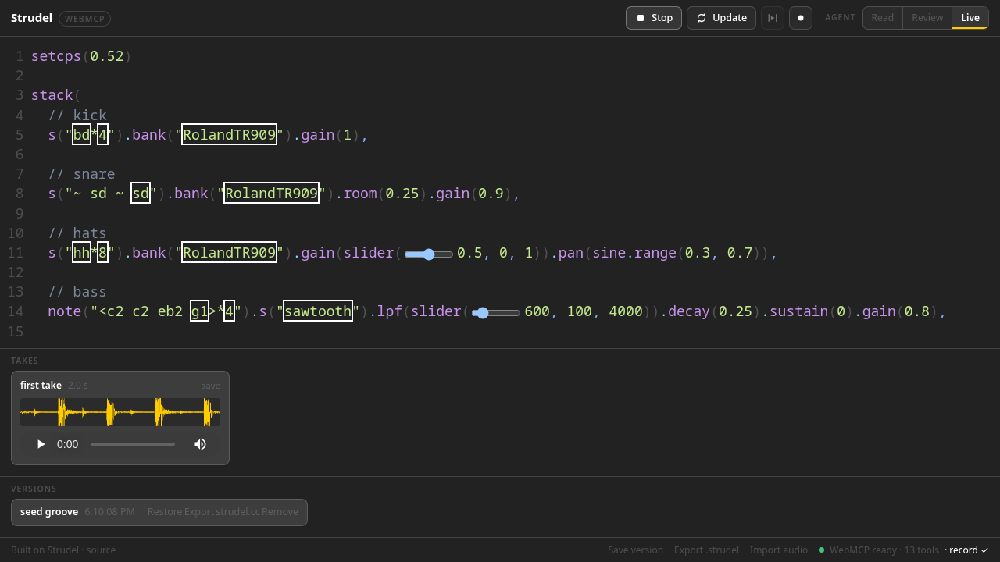

# Strudel WebMCP

> Live-code together.

<p align="center">
  
</p>

<p align="center">
  <sub>Review mode: propose, audition, accept — with real captured Strudel audio under the narration in the full demo.</sub>
</p>

<table align="center">
  <tr>
    <td align="center" width="33%">
      <br>
      <sub>Drag a slider, watch the literal update live</sub>
    </td>
    <td align="center" width="33%">
      <br>
      <sub>Agent records a take, capturing the waveform</sub>
    </td>
    <td align="center" width="33%">
      <br>
      <sub>Agent answers from real dBFS analysis, not a guess</sub>
    </td>
  </tr>
</table>

Strudel WebMCP progressively enhances the normal Strudel browser REPL with
semantic tools for the browser agent already accompanying the user.

The human can type, select code, move inline sliders, and perform normally.
The agent can read and edit that exact same CodeMirror document, evaluate
changes in the same live Strudel scheduler, and record what it all sounds
like — under a permission dial the human owns.

No AI SDK.
No MCP server.
No WebSocket bridge.
No session ID.



## Why WebMCP

|                      | Strudel MCP bridge       | Strudel WebMCP           |
|----------------------|---------------------------|---------------------------|
| Setup                | configure connector       | open page                 |
| Bridge               | MCP + websocket/SSE       | none                      |
| Session identity     | often explicit ID         | current browser tab       |
| Editor               | synchronized copy/UI      | exact live editor         |
| Human slider changes | synchronization layer     | already same source       |
| Runtime              | bridged session           | exact current REPL        |
| AI embedded          | maybe                     | never                     |

This doesn't mean agent control of Strudel was impossible before — existing
MCP-based Strudel projects already show it can be done. The difference is what
this integration requires to work: opening the page, nothing else.

## What the agent can do

Thirteen WebMCP tools, all operating on the visible editor the human sees:

- `strudel_get_context` — read live playback state, cursor, current human
  selection, what is sounding right now, the agent mode, and any pending
  proposal, solo or recording.
- `strudel_get_code` — read the exact current (possibly unsaved) source,
  optionally by line range.
- `strudel_apply_edits` — atomically replace one or more ranges of the
  visible source; in review mode this becomes a proposal with a diff the
  human auditions and accepts.
- `strudel_replace_code` — replace the entire visible source (same
  mode/proposal behaviour).
- `strudel_evaluate` — run Strudel's native Update on the visible source,
  live; or solo just a range; or audition a pending proposal.
- `strudel_play` / `strudel_stop` — start/stop playback via the native
  paths.
- `strudel_focus_range` — select and scroll to a range so the human sees
  what the agent means.
- `strudel_record` — record the live output (master, or one
  `.analyze("id")` voice) and get dBFS/band analysis plus a playable take
  in the page.
- `strudel_list_sounds` / `strudel_load_samples` — see and extend the sound
  registry the session's `s("...")` actually resolves against.
- `strudel_snapshot` — save the current source as a named version
  (restore/export/open at strudel.cc).
- `strudel_set_theme` — switch the editor colour theme.

Everything mutating is stale-write guarded by a `codeHash`, and the human's
permission dial decides how much the agent may do: **read** (look, record,
point — nothing else), **review** (edits become proposals), or **live**
(edits apply directly).

Full input/output/error details: [docs/webmcp-tools.md](./docs/webmcp-tools.md).

## Try it

Live site: **https://strudel-webmcp.vercel.app**

This requires a WebMCP-capable browser or agent (for example Chrome 149+ or
Edge 150+ with the WebMCP origin trial, or ChatGPT Desktop) to exercise the
agent tools. Without one, the page is still a completely normal, fully
functional Strudel REPL — WebMCP is a progressive enhancement, not a
requirement.

## Run locally

```sh
npm ci
npm run typecheck
npm test
npm run build
npm run test:e2e
npm run dev       # local dev server
npm run preview   # preview a production build
```

## How it works

```
┌─────────────────────────────────────┐
│            Browser tab              │
│                                     │
│    <strudel-editor>                 │
│         │                           │
│         ├── CodeMirror document ◄── HUMAN
│         │        │                  │
│         │        ├── selection      │
│         │        └── sliders        │
│         │                           │
│         └── Strudel REPL            │
│              │                      │
│              └── scheduler/audio    │
│                                     │
│         ↕                           │
│   StrudelAdapter                    │
│         ↕                           │
│   WebMCP tools                      │
│         ↕                           │
│ document.modelContext               │
└──────────────┬──────────────────────┘
               │
               ▼
      compatible browser agent
```

There is one source of truth: the visible CodeMirror document. The adapter
(`src/strudel/adapter.ts`) reads it fresh on every call and stale-write guards
every mutation with a `codeHash`, so a human edit — including moving an inline
slider — always beats an agent write made from an older read. See
[docs/architecture.md](./docs/architecture.md) for the full data-flow
breakdown.

## Tests

- `npm test` — unit tests (Vitest): hashing, position/offset conversion, edit
  validation, stale-hash rejection, source-size bounds, error normalization.
- `npm run test:e2e` — Playwright end-to-end tests against the real
  `<strudel-editor>`, including the inline-slider stale-write test and the
  agent-modes suite (read denials, the proposal lifecycle, solo, both
  recording modes, samples, snapshots, themes).

## Repository layout

```
src/
  main.ts            # app shell, mounts <strudel-editor>, wires transport + WebMCP
  demo-pattern.ts     # seed composition
  strudel/            # the adapter seam — the only code that touches @strudel/repl internals
  webmcp/             # tool definitions, schemas, registration, error/result helpers
  ui/                 # human-side chrome: status strip, mode dial, proposals, takes, shelf
docs/
  architecture.md
  webmcp-tools.md
tests/
  unit/, e2e/, webmcp-shim.ts   # test-only WebMCP shim, never shipped
```

## License

AGPL-3.0-only. See [LICENSE](./LICENSE) and [NOTICE.md](./NOTICE.md).

Built on Strudel, the browser-based live coding environment for algorithmic
music.
